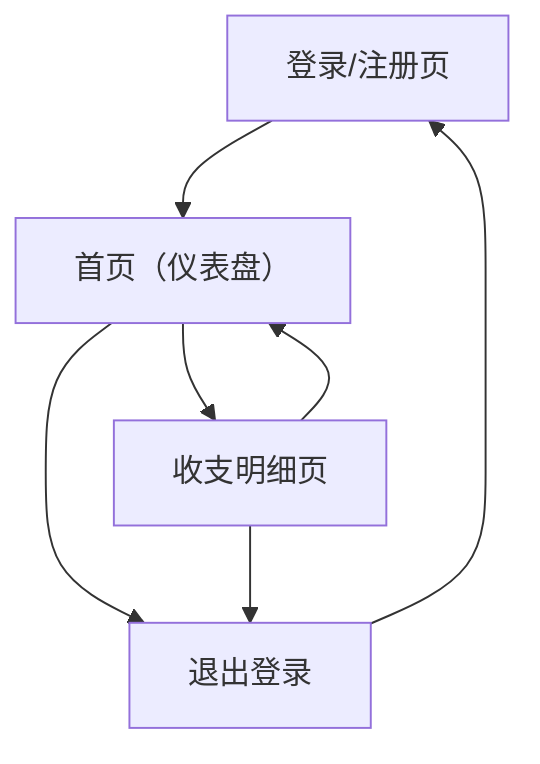

## 1. Product Overview
一款面向个人的轻量记账应用 MVP，帮助你快速记录手动收支，并查看基础统计。
核心价值：用最少步骤完成记账与复盘，形成可持续的财务记录习惯。

## 2. Core Features

### 2.1 User Roles
| 角色 | 注册方式 | 核心权限 |
|------|----------|----------|
| 普通用户 | 邮箱 + 密码注册/登录 | 仅能管理自己的收支记录；查看自己的基础统计 |

### 2.2 Feature Module
我们的记账 MVP 由以下主要页面组成：
1. **登录/注册页**：登录、注册、退出登录入口。
2. **首页（仪表盘）**：快速新增收支、近期流水、基础统计摘要与时间范围切换。
3. **收支明细页**：收支列表、筛选、手动新增/编辑/删除、分页/加载更多。

### 2.3 Page Details
| Page Name | Module Name | Feature description |
|-----------|-------------|---------------------|
| 登录/注册页 | 登录表单 | 输入邮箱与密码并登录；展示错误提示；登录成功后跳转首页 |
| 登录/注册页 | 注册表单 | 输入邮箱与密码并注册；注册成功后引导登录或自动登录 |
| 登录/注册页 | 会话管理 | 提供退出登录；未登录访问受保护页面时重定向到登录页 |
| 首页（仪表盘） | 顶部导航 | 展示应用名称与页面入口（首页/明细）；提供“退出登录”入口 |
| 首页（仪表盘） | 快速记一笔 | 选择类型（收入/支出）、输入金额、选择日期（默认今天）、填写备注（可选）并保存 |
| 首页（仪表盘） | 时间范围切换 | 切换统计口径（本月/上月/自定义日期区间）；切换后刷新摘要与列表 |
| 首页（仪表盘） | 统计摘要 | 展示时间范围内：总收入、总支出、结余（收入-支出）、笔数 |
| 首页（仪表盘） | 近期流水 | 展示最近 N 条收支；点击可跳转到明细页并带入对应筛选（如时间范围） |
| 收支明细页 | 列表与筛选 | 按时间倒序展示；按类型（收入/支出/全部）与日期区间筛选；支持分页/加载更多 |
| 收支明细页 | 新增记录 | 打开新增表单（可用弹窗/抽屉）；校验必填（类型、金额、日期）；保存后刷新列表 |
| 收支明细页 | 编辑记录 | 在列表中选择一条记录进入编辑；修改字段并保存；保存后刷新列表 |
| 收支明细页 | 删除记录 | 对单条记录执行删除并二次确认；删除后刷新列表 |

## 3. Core Process
**普通用户流程**
1. 你在登录/注册页完成注册或登录。
2. 登录成功进入首页（仪表盘），选择时间范围查看本期收入/支出/结余摘要。
3. 你可以在首页“快速记一笔”直接新增收入或支出；新增成功后近期流水与摘要同步更新。
4. 你进入收支明细页查看更完整的列表，通过类型与日期区间筛选定位记录。
5. 你在明细页对记录进行编辑或删除；操作完成后列表与统计口径保持一致。
6. 你可随时退出登录；下次访问需重新登录。

