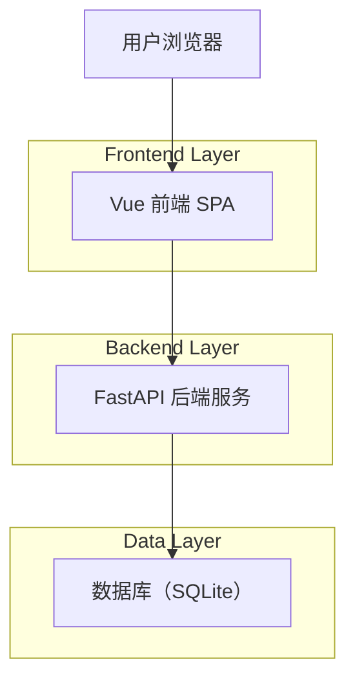
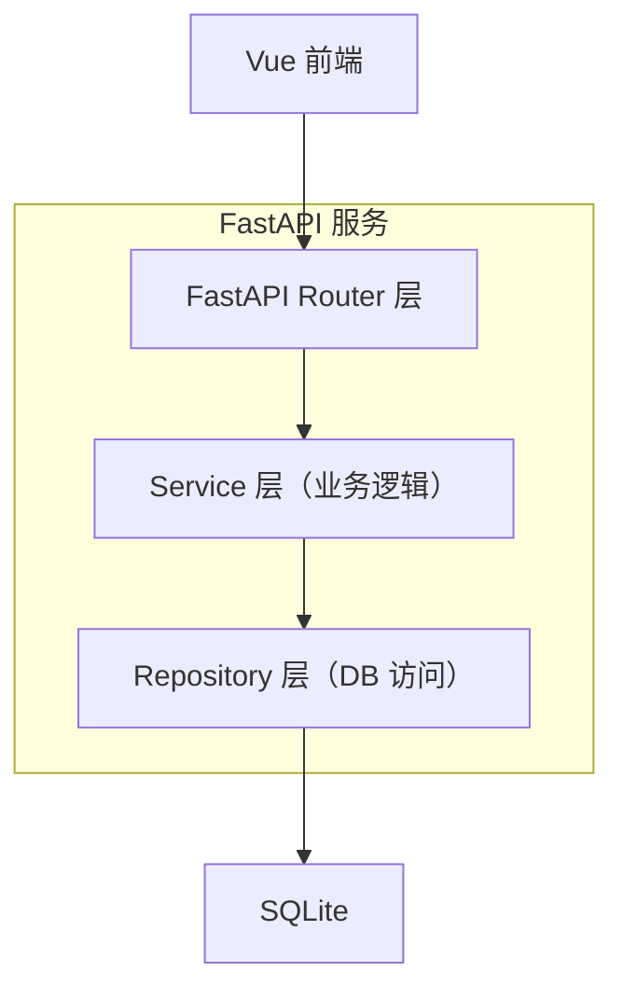
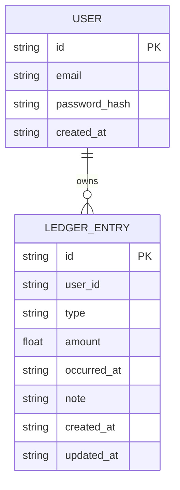

## 1.Architecture design


## 2.Technology Description
- Frontend: Vue@3 + TypeScript + vue-router@4 + Pinia + Vite
- Backend: FastAPI + Uvicorn + Pydantic
- Database: SQLite + SQLAlchemy + Alembic
- Auth: JWT（Access Token）+ 密码哈希（passlib/bcrypt）
- Charts (optional): ECharts 或 Chart.js（用于基础统计可视化）

## 3.Route definitions
| Route | Purpose |
|-------|---------|
| /login | 登录/注册页面（同页 Tab 切换） |
| / | 首页（仪表盘）：快速记一笔、摘要统计、近期流水 |
| /entries | 收支明细：列表、筛选、新增/编辑/删除 |

## 4.API definitions (If it includes backend services)
### 4.1 Shared Types (TypeScript)
```ts
export type EntryType = 'income' | 'expense'

export interface UserDTO {
  id: string
  email: string
  createdAt: string
}

export interface LedgerEntryDTO {
  id: string
  userId: string
  type: EntryType
  amount: number
  occurredAt: string // ISO date
  note?: string
  createdAt: string
  updatedAt: string
}

export interface StatsSummaryDTO {
  rangeStart: string
  rangeEnd: string
  incomeTotal: number
  expenseTotal: number
  balance: number
  count: number
}
```

### 4.2 Core API
用户认证相关
- `POST /api/auth/register`

Request:
| Param Name| Param Type | isRequired | Description |
|---|---|---:|---|
| email | string | true | 用户邮箱 |
| password | string | true | 登录密码 |

Response:
| Param Name| Param Type | Description |
|---|---|---|
| user | UserDTO | 新创建用户 |

- `POST /api/auth/login`

Request:
| Param Name| Param Type | isRequired | Description |
|---|---|---:|---|
| email | string | true | 用户邮箱 |
| password | string | true | 登录密码 |

Response:
| Param Name| Param Type | Description |
|---|---|---|
| accessToken | string | JWT access token |
| user | UserDTO | 当前用户 |

- `GET /api/me`

Response:
| Param Name| Param Type | Description |
|---|---|---|
| user | UserDTO | 当前用户 |

收支 CRUD
- `GET /api/entries?type=&start=&end=&page=&pageSize=`

Response:
| Param Name| Param Type | Description |
|---|---|---|
| items | LedgerEntryDTO[] | 列表数据（按 occurredAt 倒序） |
| page | number | 当前页 |
| pageSize | number | 页大小 |
| total | number | 总数 |

- `POST /api/entries`

Request:
| Param Name| Param Type | isRequired | Description |
|---|---|---:|---|
| type | EntryType | true | 收入/支出 |
| amount | number | true | 金额（>0） |
| occurredAt | string | true | 发生日期（ISO date） |
| note | string | false | 备注 |

Response: `LedgerEntryDTO`

- `PUT /api/entries/{id}`

Request: 同 `POST /api/entries`（全量更新或允许部分更新，二选一实现）

Response: `LedgerEntryDTO`

- `DELETE /api/entries/{id}`

Response:
| Param Name| Param Type | Description |
|---|---|---|
| ok | boolean | 是否删除成功 |

统计
- `GET /api/stats/summary?start=&end=`

Response: `StatsSummaryDTO`

## 5.Server architecture diagram (If it includes backend services)


## 6.Data model(if applicable)

### 6.1 Data model definition


### 6.2 Data Definition Language
User Table (users)
```sql
-- create table
CREATE TABLE users (
  id TEXT PRIMARY KEY,
  email TEXT NOT NULL UNIQUE,
  password_hash TEXT NOT NULL,
  created_at TEXT NOT NULL
);

CREATE INDEX idx_users_email ON users(email);
```

Ledger Entry Table (ledger_entries)
```sql
-- create table
CREATE TABLE ledger_entries (
  id TEXT PRIMARY KEY,
  user_id TEXT NOT NULL,
  type TEXT NOT NULL CHECK (type IN ('income', 'expense')),
  amount REAL NOT NULL CHECK (amount > 0),
  occurred_at TEXT NOT NULL,
  note TEXT,
  created_at TEXT NOT NULL,
  updated_at TEXT NOT NULL
);

CREATE INDEX idx_entries_user_id_occurred_at ON ledger_entries(user_id, occurred_at DESC);
CREATE INDEX idx_entries_user_id_type ON ledger_entries(user_id, type);
```